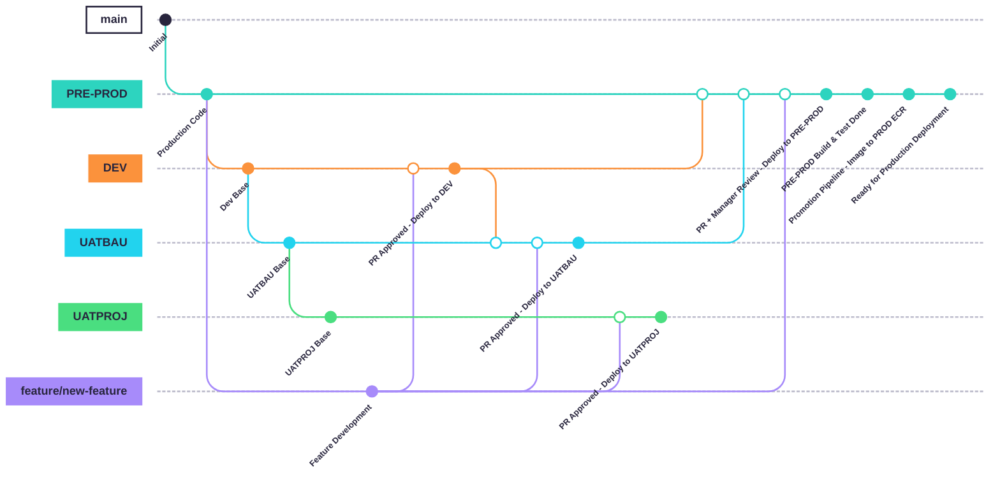
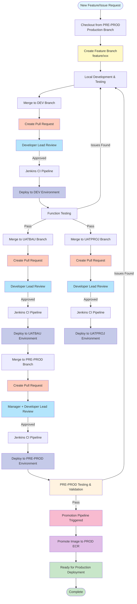
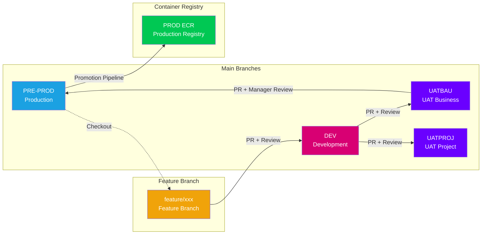
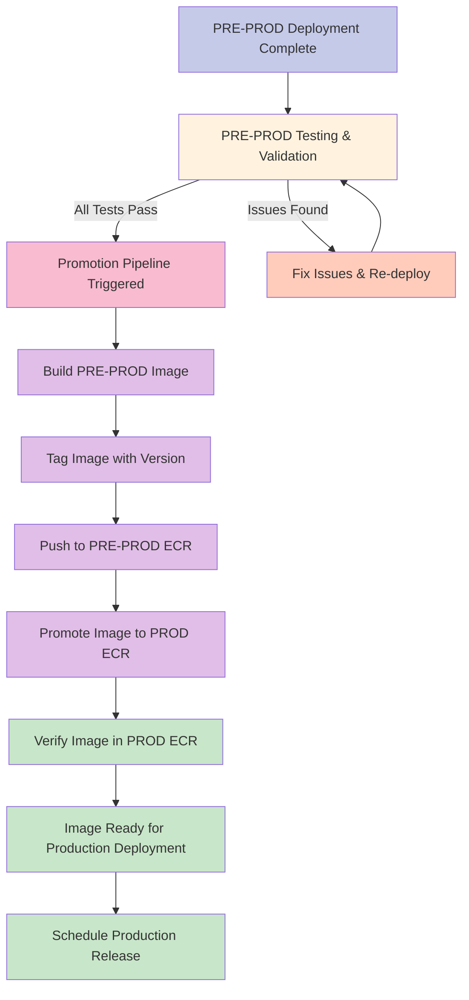
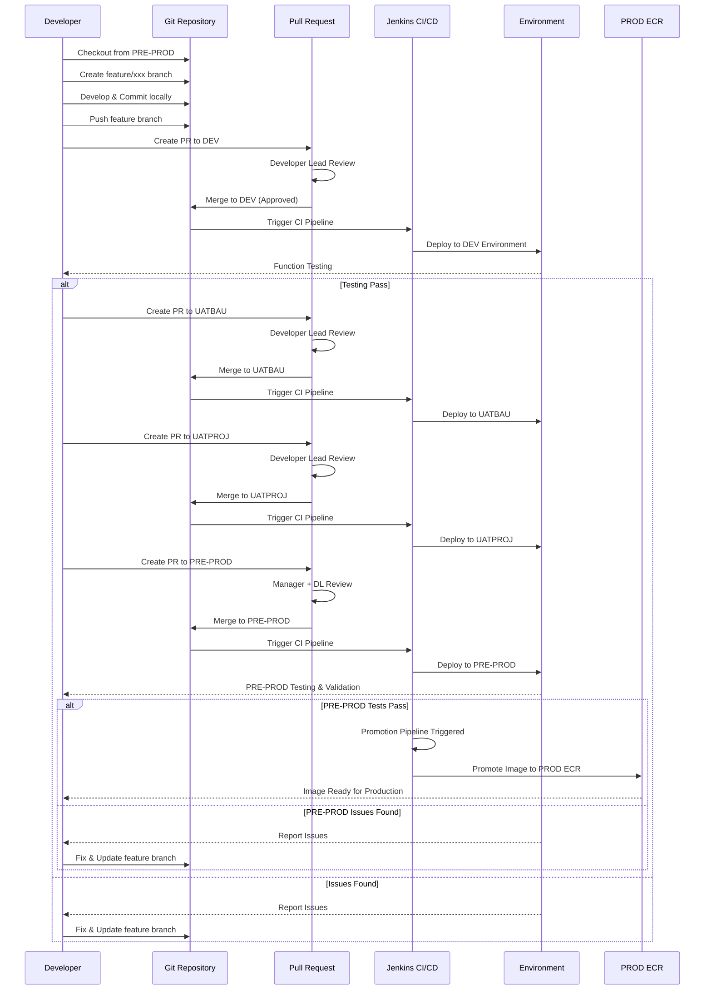

# 🌐 SATMOTOR Project Git Flow Strategy

The current Git Flow for the SATMOTOR project uses four main branches. These branches serve four specific, isolated environments and help to separate the code versions for each environment. This separation facilitates easier maintenance, issue fixing, provides multiple version storage environments, and offers better transparency for both the Development (Dev) Team and the IT/Deployment Team.

## 🌳 Main Branches and CI Integration

The four main branches configured on Git with Continuous Integration (CI) build are:

- **DEV** - Development Environment
- **PRE-PROD** - Pre-Production Environment (Production-like)
- **UATBAU** - UAT Business As Usual Environment
- **UATPROJ** - UAT Project Environment

## 🛠️ Feature Development and Issue Fixing Workflow

When a requirement for a new feature or a request to review and fix an issue on production arises:

1. The Dev team can directly checkout the latest code from the branch currently deployed on production (PRE-PROD).
2. The developer then creates a `feature_branch` or any other designated branch to run the code locally and implement/fix the issue.

## ✅ Development and Testing on DEV Environment

After completing the issue fix or feature development:

1. The developer merges the code into the **DEV** branch.
2. A Jenkins CI pipeline is automatically triggered, which builds and simultaneously deploys the code to the Dev environment (Dev Env).
3. The Dev Team uses the Dev Env to run function tests on the newly implemented version.
4. If an issue is found, the developer can checkout the code again, modify it, and the process repeats.

## 🔄 Workflow for Other Environments

A similar process applies to the remaining environments. For clear visibility:

- Each environment has its own dedicated Git branch with a clear naming convention.
- Any feature development can be merged into a specific environment branch with a clear objective.
- Jenkins will automatically trigger the CI process and then deploy to the correct environment corresponding to that branch's name.

## 🚀 Production Promotion Pipeline

After successful deployment and testing in the PRE-PROD environment:

1. The PRE-PROD environment undergoes comprehensive testing and validation.
2. Once all tests pass and the build is verified, a **Promotion Pipeline** is triggered.
3. The Promotion Pipeline promotes the PRE-PROD Docker image to the **PROD ECR** (Elastic Container Registry).
4. The image is now available in PROD ECR and ready for production deployment.
5. The production release can be scheduled and deployed using the promoted image from PROD ECR.

**Note:** The promotion pipeline ensures that only tested and validated images from PRE-PROD are available for production deployment, maintaining a clear separation between pre-production and production container registries.

## 🔒 Branch Protection and Approval Process (Pull Requests)

All current branches are configured with protection rules and can only be merged via a Pull Request (PR). This ensures that a Developer Lead or Manager can review the code changes and approve whether the code is suitable for merging into that branch for deployment.

---

## 📊 Visual Git Flow Diagrams

### 1. Git Graph - Branch Structure



### 2. Detailed Workflow Diagram



### 3. Branch Structure and Flow



### 4. Production Promotion Pipeline Flow



### 5. Environment Deployment Flow



## 📋 Branch Protection Rules Summary

| Branch | Protection | Required Reviewers | Merge Method |
|--------|-----------|-------------------|--------------|
| **DEV** | ✅ Protected | Developer Lead | Pull Request Only |
| **UATBAU** | ✅ Protected | Developer Lead | Pull Request Only |
| **UATPROJ** | ✅ Protected | Developer Lead | Pull Request Only |
| **PRE-PROD** | ✅ Protected | Manager + Developer Lead | Pull Request Only |

## 🔄 Typical Workflow Steps

1. **Start Development**
   ```bash
   git checkout PRE-PROD
   git pull origin PRE-PROD
   git checkout -b feature/new-feature
   ```

2. **Develop Locally**
   - Make changes
   - Test locally
   - Commit changes

3. **Push and Create PR to DEV**
   ```bash
   git push origin feature/new-feature
   # Create PR via Git web interface
   ```

4. **After PR Approval**
   - Code merges to DEV
   - Jenkins automatically builds and deploys to DEV environment
   - Team tests in DEV environment

5. **Promote to Other Environments**
   - Create PR from DEV to UATBAU/UATPROJ
   - After approval, Jenkins deploys to respective environments

6. **Final Promotion to PRE-PROD**
   - Create PR from UATBAU to PRE-PROD
   - Requires Manager + Developer Lead approval
   - After approval, Jenkins deploys to PRE-PROD environment
   - Run comprehensive testing and validation in PRE-PROD

7. **Production Promotion Pipeline**
   - After PRE-PROD build and testing are completed successfully
   - Promotion Pipeline is automatically triggered
   - PRE-PROD Docker image is promoted to PROD ECR
   - Image is now available in PROD ECR and ready for production deployment
   - Production release can be scheduled using the promoted image

## 📝 Notes

- All branches are protected and require Pull Request for merging
- Each environment has its own dedicated branch
- Jenkins CI/CD automatically triggers on merge to any main branch
- Feature branches should be deleted after successful merge
- Always checkout from PRE-PROD (production branch) when starting new features
- Promotion Pipeline automatically promotes PRE-PROD images to PROD ECR after successful testing
- Only tested and validated images from PRE-PROD are available in PROD ECR for production deployment

---

## 🌐 Supported Git Platforms for Diagram Viewing

This document uses **Mermaid** diagrams which are supported natively by:

- ✅ **GitHub** - Full support, renders automatically in Markdown files
- ✅ **GitLab** - Full support, renders automatically in Markdown files
- ✅ **Bitbucket** - Supported (version 2021+)
- ✅ **Azure DevOps** - Supported with extensions
- ✅ **Gitea** - Supported (version 1.12+)

You can also preview these diagrams at: https://mermaid.live

---

*Last Updated: Nov 2025*

